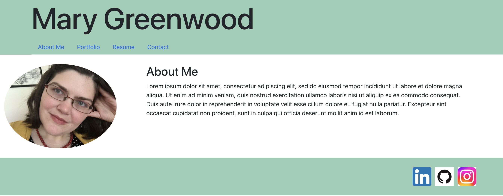

# Mary Greenwood Portfolio

## Description

URL: https://marysgreenwood.github.io/GreenwoodPortfolio/

An introduction to me and my work as a developer.

## Table of Contents

- [Installation](#installation)
- [Usage](#usage)
- [Contributing](#contributing)
- [Tests](#tests)
- [License](#license)
- [Questions](#questions)

## Installation

N/A

## Usage

N/A

## Contributing

N/A

## Tests

N/A

## License

This project is licensed under the MIT license.
https://opensource.org/licenses/MIT

## Questions

Github: https://github.com/marysgreenwood
Email: marysgreenwood@gmail.com
